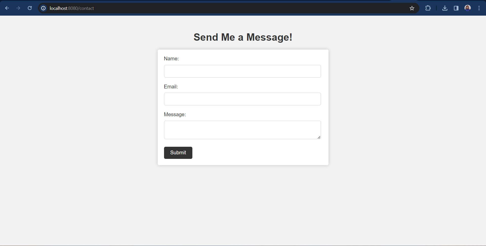

# TUGAS PBKK 13 GOOGLE APP SCRIPT

| Nama                              | NRP        | Kelas  |
| --------------------------------- | ---------- | ------ |
| Gracetriana Survinta Septinaputri | 5025211199 | PBKK B |

Pada pertemuan ke-13 ini, kami mempelajari tentang Google App Script. Google Apps Script adalah platform pengembangan aplikasi cepat yang mempercepat dan mempermudah pembuatan aplikasi bisnis yang terintegrasi dengan Google Workspace. Kita dapat menulis kode dalam JavaScript modern dan memiliki akses ke library bawaan untuk aplikasi favorit Google Workspace seperti Gmail, Kalender, Drive, dan lainnya.

Untuk tugas Google App Script ini, saya mengintegrasi Google Sheets dengan tugas saya sebelumnya yaitu form untuk mengirim pesan. Jika nanti kita mengisi form dan mengirimnya, maka data di Sheets akan terupdate secara otomatis.

## Link Live Google Sheets & Google App Script

Google Sheets : <a href="https://docs.google.com/spreadsheets/d/1NWYSyNA1cn-TkGFW3N-IUkWR3R3m00A7k5Cff-S0jg8/edit?usp=sharing"> Live Sheets</a>

Google App Script : <a href="https://script.google.com/macros/s/AKfycby8uBC4dO_TXH8mkazf5iAXIWKS1322Z1zEiJcWHLPqEJOw2ckfzA2-xB5DmOgMr-3q2w/exec">Script</a>

## Tampilan Form

